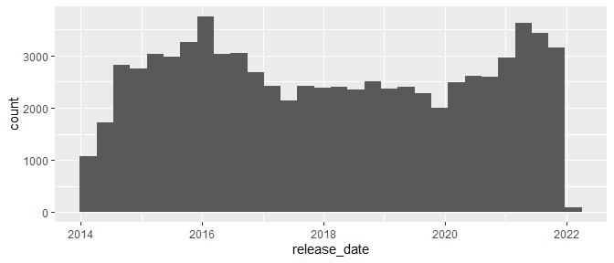
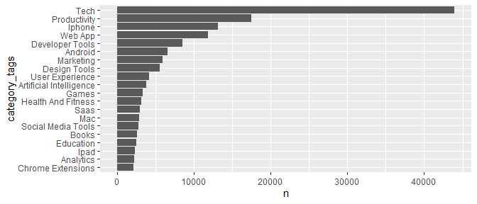

TidyTuesday 2022-10-04
================

# Load Libraries

``` r
library(tidyverse)
```

    ── Attaching packages ─────────────────────────────────────── tidyverse 1.3.2 ──
    ✔ ggplot2 3.3.6     ✔ purrr   0.3.4
    ✔ tibble  3.1.8     ✔ dplyr   1.0.9
    ✔ tidyr   1.2.1     ✔ stringr 1.4.1
    ✔ readr   2.1.3     ✔ forcats 0.5.2
    ── Conflicts ────────────────────────────────────────── tidyverse_conflicts() ──
    ✖ dplyr::filter() masks stats::filter()
    ✖ dplyr::lag()    masks stats::lag()

``` r
library(tidytuesdayR)
library(lubridate)
```


    Attaching package: 'lubridate'

    The following objects are masked from 'package:base':

        date, intersect, setdiff, union

# Load Data

``` r
data <- tt_load("2022-10-04")
```

    --- Compiling #TidyTuesday Information for 2022-10-04 ----

    --- There is 1 file available ---

    --- Starting Download ---


        Downloading file 1 of 1: `product_hunt.csv`

    --- Download complete ---

``` r
df <- data %>% pluck(1)
```

# Explore

## Realease date distribution

``` r
df %>% 
  ggplot(aes(release_date)) +
  geom_histogram()
```

    `stat_bin()` using `bins = 30`. Pick better value with `binwidth`.



## Realease date and upvotes

``` r
df %>% 
  mutate(release_date = floor_date(release_date, unit = "month")) %>% 
  group_by(release_date) %>% 
  summarise(upvotes = sum(upvotes)) %>% 
  ggplot(aes(release_date, upvotes)) +
  geom_line()
```


## Average upvote per product by release date

``` r
df %>% 
  mutate(release_date = floor_date(release_date, unit = "month")) %>% 
  group_by(release_date) %>% 
  summarise(avg_upvotes = mean(upvotes)) %>% 
  ggplot(aes(release_date, avg_upvotes)) +
  geom_line()
```


## Create categories data frame

``` r
df_categories <- df %>% 
  separate_rows(category_tags, sep = "', '") %>% 
  mutate(category_tags = str_remove_all(category_tags, pattern = "['\\[\\]]"))
```

``` r
df_categories %>% 
  count(category_tags = fct_lump(category_tags, 20)) %>% 
  mutate(category_tags = fct_reorder(str_to_title(category_tags), n)) %>% 
  filter(category_tags != "Other") %>% 
  ggplot(aes(category_tags, n)) +
  geom_col() +
  coord_flip()
```


