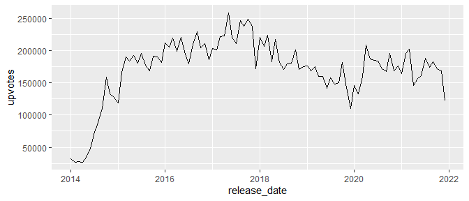
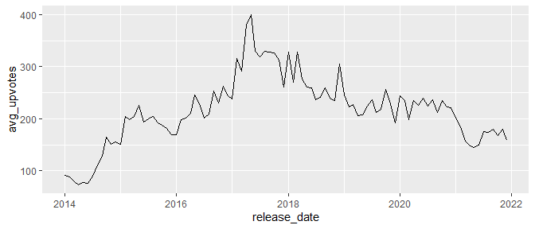
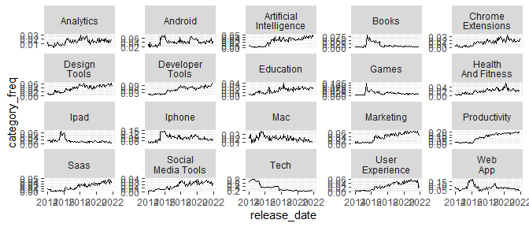
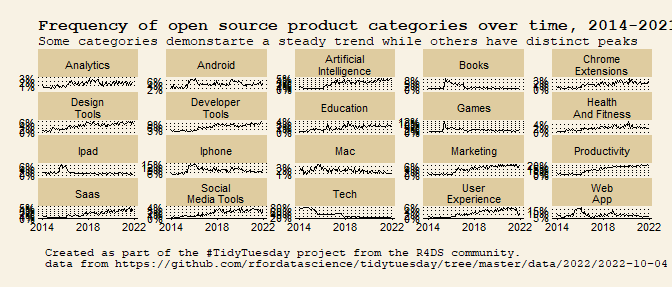

TidyTuesday 2022-10-04
================

- <a href="#load-libraries" id="toc-load-libraries">Load Libraries</a>
- <a href="#load-data" id="toc-load-data">Load Data</a>
- <a href="#explore" id="toc-explore">Explore</a>
  - <a href="#realease-date-distribution"
    id="toc-realease-date-distribution">Realease date distribution</a>
  - <a href="#realease-date-and-upvotes"
    id="toc-realease-date-and-upvotes">Realease date and upvotes</a>
  - <a href="#average-upvote-per-product-by-release-date"
    id="toc-average-upvote-per-product-by-release-date">Average upvote per
    product by release date</a>
  - <a href="#create-categories-data-frame"
    id="toc-create-categories-data-frame">Create categories data frame</a>
  - <a href="#most-frequent-categories"
    id="toc-most-frequent-categories">Most frequent categories</a>
  - <a href="#most-frequent-categories-by-date"
    id="toc-most-frequent-categories-by-date">Most frequent categories by
    date</a>
- <a href="#visualize" id="toc-visualize">Visualize</a>

# Load Libraries

``` r
library(tidyverse)
```

    ── Attaching packages ─────────────────────────────────────── tidyverse 1.3.2 ──
    ✔ ggplot2 3.3.6     ✔ purrr   0.3.4
    ✔ tibble  3.1.8     ✔ dplyr   1.0.9
    ✔ tidyr   1.2.1     ✔ stringr 1.4.1
    ✔ readr   2.1.3     ✔ forcats 0.5.2
    ── Conflicts ────────────────────────────────────────── tidyverse_conflicts() ──
    ✖ dplyr::filter() masks stats::filter()
    ✖ dplyr::lag()    masks stats::lag()

``` r
library(tidytuesdayR)
library(lubridate)
```


    Attaching package: 'lubridate'

    The following objects are masked from 'package:base':

        date, intersect, setdiff, union

``` r
library(scales)
```


    Attaching package: 'scales'

    The following object is masked from 'package:purrr':

        discard

    The following object is masked from 'package:readr':

        col_factor

``` r
library(ggthemes)
```

# Load Data

``` r
data <- tt_load("2022-10-04")
```

    --- Compiling #TidyTuesday Information for 2022-10-04 ----

    --- There is 1 file available ---

    --- Starting Download ---


        Downloading file 1 of 1: `product_hunt.csv`

    --- Download complete ---

``` r
df <- data %>% pluck(1)
```

# Explore

## Realease date distribution

``` r
df %>% 
  ggplot(aes(release_date)) +
  geom_histogram()
```

    `stat_bin()` using `bins = 30`. Pick better value with `binwidth`.


## Realease date and upvotes

``` r
df %>% 
  mutate(release_date = floor_date(release_date, unit = "month")) %>% 
  group_by(release_date) %>% 
  summarise(upvotes = sum(upvotes)) %>% 
  ggplot(aes(release_date, upvotes)) +
  geom_line()
```



## Average upvote per product by release date

``` r
df %>% 
  mutate(release_date = floor_date(release_date, unit = "month")) %>% 
  group_by(release_date) %>% 
  summarise(avg_upvotes = mean(upvotes)) %>% 
  ggplot(aes(release_date, avg_upvotes)) +
  geom_line()
```



## Create categories data frame

``` r
df_categories <- df %>% 
  separate_rows(category_tags, sep = "', '") %>% 
  mutate(
    category_tags = str_remove_all(category_tags, pattern = "['\\[\\]]"),
    category_tags = str_to_title(category_tags)
    )
```

## Most frequent categories

``` r
df_categories %>% 
  count(category_tags = fct_lump(category_tags, 20)) %>% 
  mutate(category_tags = fct_reorder(category_tags, n)) %>% 
  filter(category_tags != "Other") %>% 
  ggplot(aes(category_tags, n)) +
  geom_col() +
  coord_flip()
```


## Most frequent categories by date

``` r
cat_plot <- df_categories %>% 
  mutate(
    release_date = floor_date(as_date(release_date), unit = "month"),
    category_tags = fct_lump(category_tags, n = 20),
    category_tags = str_replace(category_tags, pattern = " ", replacement = "\n")
  ) %>% 
  filter(category_tags != "Other") %>% 
  count(release_date, category_tags) %>% 
  group_by(release_date) %>% 
  mutate(category_freq = n / sum(n)) %>% 
  ungroup() %>% 
  ggplot(aes(release_date, category_freq)) +
  geom_line() +
  facet_wrap(~ category_tags, scales = "free_y")

cat_plot
```



# Visualize

``` r
cat_plot +
  scale_y_continuous(labels = label_percent(accuracy = 1)) +
  scale_x_date(breaks = ymd(c("2014-01-01", "2018-01-01", "2022-01-01")), date_labels = "%Y") +
  labs(
    title = "Frequency of tech product categories over time, 2014-2021",
    subtitle = "Some categories demonstarte a steady trend while others have distinct peaks",
    caption = "\n Created as part of the #TidyTuesday project from the R4DS community. \n data from https://github.com/rfordatascience/tidytuesday/tree/master/data/2022/2022-10-04"
  ) +
  theme_wsj(base_size = 5) + 
  theme(
    strip.background = element_rect(fill = "#dfcca0"),
    strip.text = element_text(size = 8),
    axis.text = element_text(size = 8, face = "plain"),
    plot.caption = element_text(hjust = 0)
  )
```


